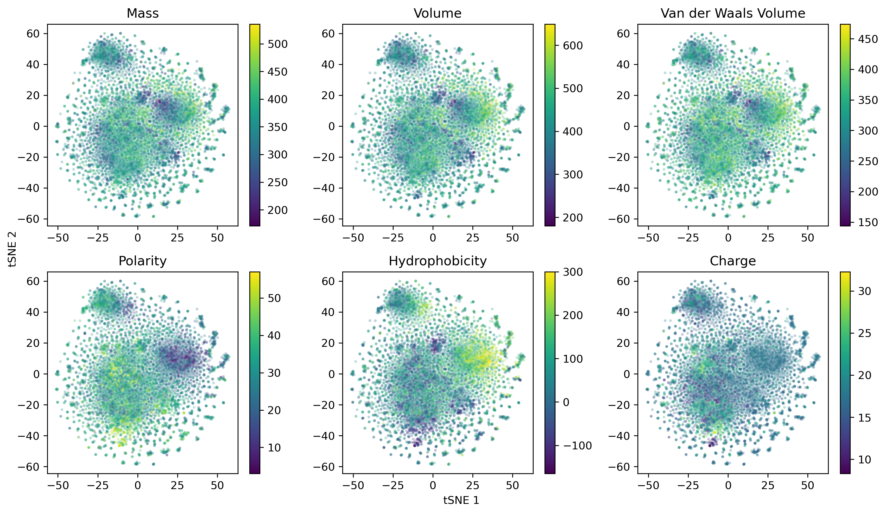

# protvec

PyTorch and gensim models of Protein-Vectors from [Asgari et al 2015](https://journals.plos.org/plosone/article?id=10.1371/journal.pone.0141287). 
Protein sequences are chunked into amino acid n-grams, and are represented as dense vectors distributed in embedding space based on context similarity.
The model is trained with the word2vec skip-gram method with negative sampling. 

## Example

### PyTorch 

This method is extremely slow and too memory intensive for practical usage, here for demonstration purposes only.

#### Setup dataset

```
usage: train.py [-h] [-c CORPUS] [-m MIN] [-n CONTEXT] [-k NGRAM] [-g NEG]
                [-b BATCH] [-t] [-e EMBED] [-l LR] [-p EPOCHS] [-o OUTPUT]

optional arguments:
  -h, --help            show this help message and exit
  -c CORPUS, --corpus CORPUS
                        Path to corpus file containing amino acid sequences
  -m MIN, --min MIN     Minimum frequency for kmer (default: 3)
  -n CONTEXT, --context CONTEXT
                        Context size, select context//2 + 1 around center
                        (default: 25)
  -k NGRAM, --ngram NGRAM
                        Ngram size (default: 3)
  -g NEG, --neg NEG     Number of negative samples (default: 5)
  -b BATCH, --batch BATCH
                        Batch size (default: 512)
  -t, --train           Train model
  -e EMBED, --embed EMBED
                        Embedding dimension size (default: 100)
  -l LR, --lr LR        Learning rate (default: 0.003)
  -p EPOCHS, --epochs EPOCHS
                        Epochs (default: 5)
  -o OUTPUT, --output OUTPUT
                        Embedding vectors output filename
```

1. Generate corpus from fasta, chunk into n-grams, numericalize, subsample, and split n-grams into contexts and centers.
Adjust dimensionality, context size, n-gram size with optional arguments.

```python train.py -c <input_fasta>```

2. Run training after input is generated

```python train.py -t```

3. Download amino acid properties and calculate for each n-gram.

```python aa_properties.py -d -p```

4. Plot tSNE of embedding vectors

```python eval.py```

### Gensim

```
usage: gensim_train.py [-h] [-c CORPUS] [-k NGRAM] [-m MIN] [-n CONTEXT]
                       [-g NEG] [-e EMBED] [-t] [-p EPOCHS]

optional arguments:
  -h, --help            show this help message and exit
  -c CORPUS, --corpus CORPUS
  -k NGRAM, --ngram NGRAM
  -m MIN, --min MIN
  -n CONTEXT, --context CONTEXT
  -g NEG, --neg NEG
  -e EMBED, --embed EMBED
  -t, --train
  -p EPOCHS, --epochs EPOCHS
  ```
  
 1. Corpus to n-grams

```python gensim_train.py -c <input_fasta>```

2. Train

```python gensim_train.py -t```

3. Evaluate

```python eval.py```

## Results

```
python gensim_train.py --corpus inputs/uniprot-reviewed-lim_sequences.txt
python gensim_train.py --train --ngram 3 --min 3 --context 25 --neg 5 --embed 100 --epochs 50
```


